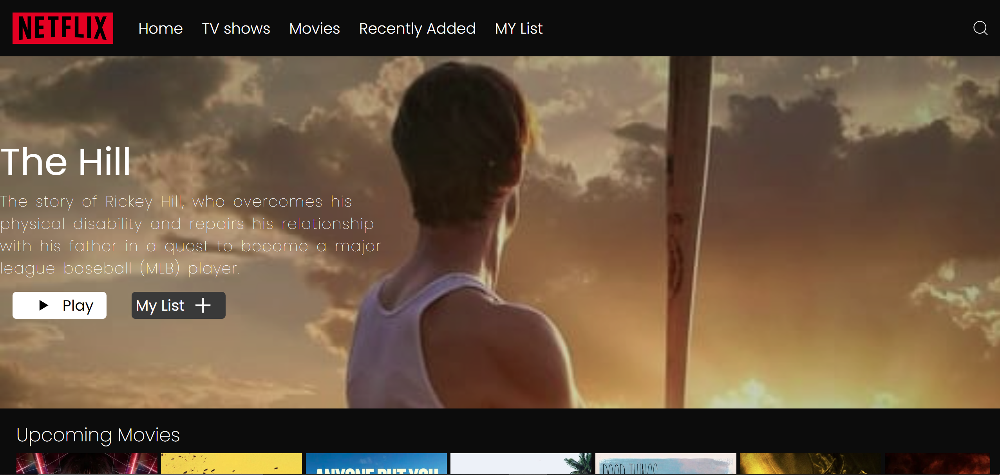

# This Project Goals:
- Practice working with external APIs and fetching data from a remote server.
- Gain experience in building dynamic and interactive user interfaces with React.js.
- Improve skills in routing, state management, and component composition.
- Showcase proficiency in frontend development and UI design through a functional and visually appealing application.

- ###  Note: `Industry standard` file structuring is not followed here. For `industry standard`  and `clean code` , take  a look at these projects of mine :
    - [Nib-stram](https://github.com/NIBRAS-N/Nib-Stram)
    - [Nib-sociorama](https://github.com/NIBRAS-N/Nib-Sociorama)

- ### Overview:

